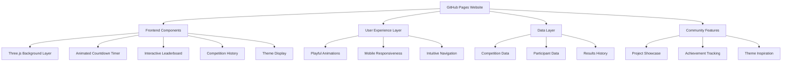
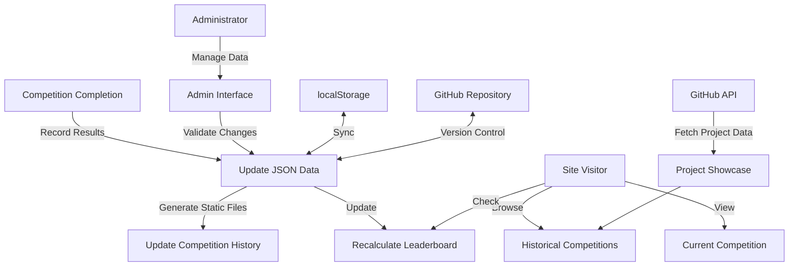

# CodeClash: A Playful GitHub Pages Programming Competition Hub

## Introduction

CodeClash is a dynamic GitHub Pages website designed to serve as the central hub for a biweekly programming competition among friends. This platform celebrates coding creativity, fosters friendly competition, and builds community through regular programming challenges. With a focus on playful design elements and community engagement, CodeClash transforms a simple competition tracking system into an engaging experience that motivates participants and showcases their talents.

## Project Description

The CodeClash platform facilitates a programming competition where participants submit projects as GitHub repositories every two weeks. Each competition revolves around a unique theme announced in advance, challenging participants to exercise their creativity and technical skills in different contexts. The community (typically 5-10 participants) then votes on submissions to determine winners.

Beyond simply tracking winners, CodeClash emphasizes the journey of learning and growth. The platform aims to foster a supportive environment where participants can:
- Showcase their coding skills and creativity
- Learn from each other's approaches to challenges
- Build a portfolio of interesting projects over time
- Celebrate both participation and excellence

## Community Focus

CodeClash is built with community at its center, recognizing that the social aspects of coding competitions are what make them meaningful and sustainable:

- **Collective Learning**: The platform highlights different approaches to the same challenge, allowing participants to learn from each other's techniques and solutions.
- **Friendly Competition**: While tracking winners, the focus remains on celebration rather than intense competition, creating a supportive atmosphere.
- **Skill Development Tracking**: Beyond the leaderboard, the platform recognizes growth and improvement over time.
- **Social Connection**: The competition serves as a regular touchpoint for friends to connect through code, regardless of physical location.
- **Knowledge Sharing**: Each competition becomes an opportunity to explore new technologies, patterns, or programming concepts together.

## Key Features

### Ambient Interactive Background
- Three.js-powered subtle dynamic background effects that respond to user interactions
- Gentle animations that don't distract from content but add visual interest
- Theme-influenced visual elements that subtly change with each competition's theme
- Performance-optimized effects that work well across various devices

### Countdown Timer
- Prominently displayed countdown to the next deadline (8:30pm on 5/14)
- Subtle animations that become slightly more pronounced as the deadline approaches
- Visual and (optional) notification alerts at key milestones (1 week, 1 day, 1 hour before deadline)

### Community Leaderboard
- Overall standings showing participants ranked by competition wins
- Playful visual representations that celebrate achievements
- Animated elements that highlight position changes
- Statistics beyond just wins (participation streak, most creative solutions, etc.)

### Competition History Showcase
- Interactive timeline displaying the evolution of competitions
- Detailed information about each past competition including:
  - Theme and dates
  - Winner and all participants
  - Links to all submitted GitHub repositories
  - Highlight snippets or screenshots from notable entries
- Filtering and sorting capabilities to explore past competitions

### Theme Announcement & Inspiration
- Dynamic presentation of the current competition theme
- Resources related to the theme to spark inspiration
- Optional community discussion area for theme-related questions
- Archive of past themes with associated winning projects

## User Experience Considerations

- **Playful Yet Professional**: The design incorporates fun elements while maintaining a clean, usable interface that keeps content readable and navigable.
- **Responsive Design**: The site functions seamlessly across desktop and mobile devices, allowing participants to check standings and updates from anywhere.
- **Performance First**: Three.js effects are implemented with performance in mind, with fallbacks for less powerful devices.
- **Intuitive Navigation**: Clear information hierarchy with smooth transitions between different sections of the site.
- **Visual Feedback**: Subtle animations provide feedback for user interactions, making the site feel responsive and alive.

## Technical Implementation

### Core Technologies
- GitHub Pages for hosting (static site)
- Three.js for ambient background effects and subtle animations
- HTML/CSS/JavaScript foundation
- Responsive design principles
- Modern JavaScript (ES6+) features

### Data Storage and Management

#### Data Storage Options

1. **JSON Configuration Files**
   - Store competition data in structured JSON files directly in the GitHub repository
   - Separate files for participant data, competition results, and leaderboard standings
   - Example structure:
     ```
     /data
       /competitions
         competition-2025-05-01.json
         competition-2025-04-15.json
       /participants
         participants.json
       leaderboard.json
     ```
   - Benefits: Simple to implement, version controlled, transparent history

2. **GitHub API Integration**
   - Leverage GitHub API to fetch repository information directly
   - Link competitions to specific GitHub issues or pull requests
   - Potentially use GitHub project boards for competition tracking
   - Benefits: Tight integration with where projects are actually hosted

3. **Local Storage with Export/Import**
   - Use browser's localStorage for active session data
   - Provide export/import functionality for administrators
   - Include backup/restore functionality using downloadable JSON
   - Benefits: Works without backend, allows for manual updates

4. **Hybrid Approach (Recommended)**
   - Base data in static JSON files (for SEO and initial loading)
   - Dynamic updates using localStorage for the current session
   - Periodic updates to the repository via pull requests
   - Benefits: Combines stability of static files with dynamic user experience

### Competition History Maintenance

1. **Automated History Generation**
   - Script to generate static HTML/JSON from competition data
   - Run on each competition conclusion (could be part of GitHub Actions)
   - Maintains consistency and reduces manual work
   - Ensures competition records are properly archived

2. **Historical Views**
   - Dedicated section for browsing past competitions
   - Filterable by theme, date, winner, or technologies used
   - Timeline visualization showing competition evolution
   - Historical participation metrics to show community growth

3. **Project Archiving**
   - Store screenshots of winning projects to preserve their appearance
   - Archive important code snippets or techniques used
   - Link to GitHub repositories (with specific commit hashes to prevent link rot)
   - Documentation of notable innovations from each competition

4. **Data Integrity**
   - Validation process when adding new competition results
   - Hash verification of previous results to detect tampering
   - Clear separation between current competition and historical data
   - Backup system for competition history

5. **Admin Tools**
   - Simple admin interface for managing competition data
   - Form-based entry for new competitions and results
   - Ability to correct mistakes in historical data
   - Preview functionality before publishing updates

## Architecture Diagrams

### Component Structure


### Data Flow


## Implementation Approach

1. **Project Setup**
   - Initialize GitHub Pages repository
   - Set up basic project structure
   - Configure development environment

2. **Core Framework**
   - Establish Three.js foundation for background effects
   - Create responsive HTML/CSS structure
   - Set up basic navigation and page layouts

3. **Data Structure Implementation**
   - Create JSON schemas for competition data
   - Set up data loading and parsing functions
   - Implement data management utilities

4. **Feature Implementation**
   - Develop countdown timer functionality
   - Build leaderboard display components
   - Create competition history browsing interface
   - Implement theme announcement section

5. **Enhancement and Animation**
   - Add Three.js ambient backgrounds and effects
   - Implement subtle animations for UI elements
   - Create transitions between sections

6. **Testing and Optimization**
   - Test across different devices and browsers
   - Optimize Three.js performance
   - Ensure accessibility of all features

7. **Documentation and Launch**
   - Create admin documentation
   - Finalize user guides
   - Launch the platform for first competition

## Future Enhancement Possibilities

- **Profile Pages**: Simple personalized pages displaying a participant's competition history and achievements
- **Achievement System**: Badges or recognition for different accomplishments beyond winning (most creative, best use of technology, etc.)
- **Theme Voting**: Allow participants to suggest and vote on future themes
- **Discussion/Feedback**: A simple system for leaving comments on projects to encourage constructive feedback
- **Notification System**: Opt-in notifications for deadlines, new competitions, and results
- **Project Preview**: Interactive preview of projects directly on the site (where possible)
- **Communal Resources**: A section for sharing helpful resources, articles, and tools relevant to programming competitions

## Conclusion

The CodeClash platform transforms a simple programming competition into a community-building experience. By combining practical functionality with playful design elements, the site makes participation more engaging while still effectively tracking competition results. The focus on community aspects, coupled with subtle Three.js animations, creates a visually appealing yet functionally robust hub for friends to compete, learn, and grow their programming skills together.