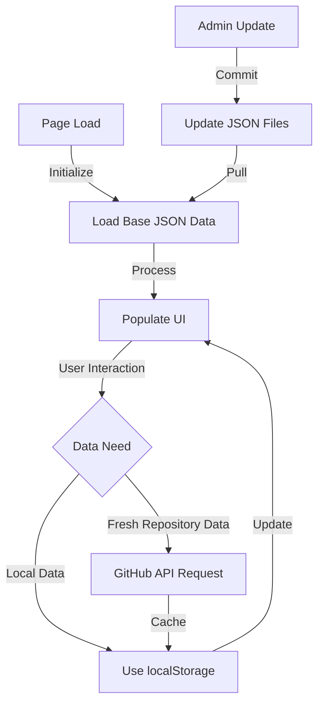
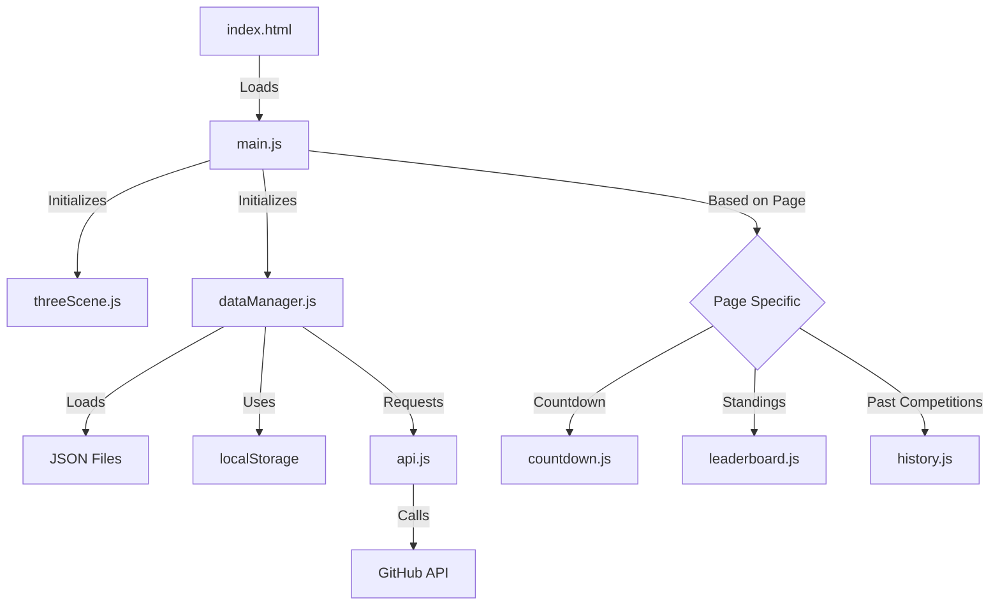

# CodeClash Project Structure

## Directory Structure

```
codeclash/                     # Root directory of the GitHub Pages site
│
├── index.html                 # Main entry point and landing page
├── leaderboard.html           # Page showing overall competition standings
├── history.html               # Page displaying competition history
├── current.html               # Current competition details and countdown
│
├── css/                       # CSS stylesheets
│   ├── main.css               # Main stylesheet for common elements
│   ├── animations.css         # CSS animations and transitions
│   └── responsive.css         # Media queries and responsive design rules
│
├── js/                        # JavaScript files
│   ├── main.js                # Main JavaScript handling general functionality
│   ├── threeScene.js          # Three.js implementation for background effects
│   ├── countdown.js           # Countdown timer functionality
│   ├── leaderboard.js         # Leaderboard display and sorting
│   ├── history.js             # Competition history browsing and filtering
│   ├── dataManager.js         # Core data management (loading, saving)
│   └── api.js                 # GitHub API integration functions
│
├── data/                      # JSON data files
│   ├── competitions/          # Competition-specific data
│   │   ├── competition-YYYY-MM-DD.json    # One file per competition
│   │   └── ...
│   ├── participants.json      # Participant profiles and metadata
│   └── leaderboard.json       # Current standings and statistics
│
├── assets/                    # Static assets
│   ├── images/                # Image files
│   ├── fonts/                 # Custom font files
│   └── models/                # 3D models for Three.js (if any)
│
└── admin/                     # Admin tools (optional)
    ├── index.html             # Admin dashboard
    └── js/
        └── admin.js           # Admin functionality
```

## File Purposes and Functionality

### HTML Files

#### `index.html`
- **Purpose**: Main entry point and landing page for CodeClash
- **Functionality**:
  - Showcase the current competition theme and countdown
  - Display top participants from the leaderboard
  - Provide navigation to other sections
  - Integrate the Three.js background effects
  - Show featured projects from previous competitions

#### `leaderboard.html`
- **Purpose**: Show the overall standings and competition statistics
- **Functionality**:
  - Display participants ranked by wins
  - Show additional statistics (participation streak, etc.)
  - Provide sorting and filtering options
  - Visualize achievements and rankings

#### `history.html`
- **Purpose**: Browsing interface for past competitions
- **Functionality**:
  - Timeline view of all past competitions
  - Details for each competition including theme and dates
  - Links to winning projects and all submissions
  - Filtering capabilities by date, theme, or participant

#### `current.html`
- **Purpose**: Detailed view of the current competition
- **Functionality**:
  - Prominent countdown timer to deadline (8:30pm on 5/14)
  - Comprehensive description of the current theme
  - Resources and inspiration related to the theme
  - Submission instructions and guidelines

### CSS Files

#### `main.css`
- **Purpose**: Primary styling for the website
- **Functionality**:
  - Define the overall visual theme and color scheme
  - Style common elements (header, footer, navigation)
  - Establish typography and basic layout

#### `animations.css`
- **Purpose**: Handle animations and transitions
- **Functionality**:
  - Define keyframe animations for UI elements
  - Style interactive components (hover effects, clicks)
  - Control Three.js-related DOM element animations

#### `responsive.css`
- **Purpose**: Ensure site works on all devices
- **Functionality**:
  - Define media queries for different screen sizes
  - Adjust layouts for mobile, tablet, and desktop
  - Handle orientation changes and accessibility concerns

### JavaScript Files

#### `main.js`
- **Purpose**: Core application initialization and general functions
- **Functionality**:
  - Initialize the application
  - Handle navigation and routing
  - Coordinate between components
  - Manage page-specific content loading

#### `threeScene.js`
- **Purpose**: Implement the Three.js background effects
- **Functionality**:
  - Set up and initialize Three.js scene, camera, and renderer
  - Create ambient background effects
  - Implement performance optimization techniques
  - Handle responsive resizing for different devices
  - Structure code in a modular way for future splitting
  - Theme-related visual adjustments

#### `countdown.js`
- **Purpose**: Manage countdown timer functionality
- **Functionality**:
  - Calculate time remaining until next deadline (8:30pm on 5/14)
  - Update countdown display in real-time
  - Trigger notifications at key time points
  - Handle animations as deadline approaches

#### `leaderboard.js`
- **Purpose**: Handle leaderboard display and management
- **Functionality**:
  - Load and process leaderboard data
  - Implement sorting and filtering options
  - Create dynamic visualization of rankings
  - Animate position changes
  - Display detailed statistics for each participant

#### `history.js`
- **Purpose**: Manage competition history browsing
- **Functionality**:
  - Generate timeline visualization of past competitions
  - Load and display competition details
  - Handle filtering and search functionality
  - Connect to GitHub repositories for project viewing

#### `dataManager.js`
- **Purpose**: Core data handling functions
- **Functionality**:
  - Load JSON data files
  - Manage localStorage for session data
  - Handle data updates and persistence
  - Implement cache management
  - Synchronize between data sources (JSON, localStorage, API)

#### `api.js`
- **Purpose**: Handle GitHub API integration
- **Functionality**:
  - Set up GitHub API requests
  - Fetch repository information
  - Retrieve project details and README files
  - Implement authentication flow if needed
  - Cache API responses to minimize requests

### Data Files

#### `data/competitions/competition-YYYY-MM-DD.json`
- **Purpose**: Store information for specific competitions
- **Structure**:
```json
{
  "id": "competition-2025-05-01",
  "title": "Data Visualization Challenge",
  "theme": "Create an interactive data visualization using any dataset",
  "startDate": "2025-05-01T00:00:00Z",
  "endDate": "2025-05-14T20:30:00Z", 
  "participants": [
    {
      "username": "dev1",
      "repositoryUrl": "https://github.com/dev1/data-viz-project",
      "projectTitle": "Global Climate Trends Explorer"
    },
    // More participants
  ],
  "winner": {
    "username": "dev1",
    "repositoryUrl": "https://github.com/dev1/data-viz-project"
  },
  "resources": [
    {
      "title": "D3.js Documentation",
      "url": "https://d3js.org/",
      "type": "documentation"
    }
    // More resources
  ],
  "notes": "This competition focused on creating accessible visualizations."
}
```

#### `data/participants.json`
- **Purpose**: Store participant profiles and metadata
- **Structure**:
```json
{
  "participants": [
    {
      "username": "dev1",
      "displayName": "Developer One",
      "githubProfile": "https://github.com/dev1",
      "joinDate": "2025-01-01T00:00:00Z",
      "bio": "Full-stack developer passionate about UI/UX",
      "avatar": "https://github.com/dev1.png",
      "competitions": [
        "competition-2025-04-15",
        "competition-2025-05-01"
      ],
      "wins": [
        "competition-2025-05-01"
      ]
    },
    // More participants
  ]
}
```

#### `data/leaderboard.json`
- **Purpose**: Track current standings and statistics
- **Structure**:
```json
{
  "updatedAt": "2025-05-02T12:00:00Z",
  "standings": [
    {
      "username": "dev1",
      "wins": 1,
      "participations": 2,
      "streak": 2
    },
    // More participants
  ],
  "competitionCount": 2,
  "currentCompetitionId": "competition-2025-05-15"
}
```

## Technologies Overview

### Core Technologies
1. **HTML5**
   - Semantic markup for better accessibility and SEO
   - Canvas elements for Three.js integration
   - Local storage API for client-side data persistence

2. **CSS3**
   - Custom properties for theming
   - Flexbox and Grid for layouts
   - Animations and transitions for UI elements
   - Media queries for responsive design

3. **JavaScript (ES6+)**
   - Fetch API for data loading and GitHub API integration
   - ES6 modules for code organization
   - LocalStorage API for client-side data persistence
   - Promise-based async programming

4. **Three.js**
   - WebGL-based 3D rendering for background effects
   - Scene management and camera controls
   - Performance optimization techniques
   - Responsive design integration

### Libraries and Dependencies

1. **Three.js**
   - Purpose: Create ambient interactive background
   - Version: Latest stable
   - CDN: `https://cdn.jsdelivr.net/npm/three@latest/build/three.min.js`

2. **Day.js**
   - Purpose: Date manipulation and countdown timer functionality
   - Version: Latest stable
   - CDN: `https://cdn.jsdelivr.net/npm/dayjs@latest/dayjs.min.js`

3. **Marked.js** (optional)
   - Purpose: Markdown parsing for README files from GitHub
   - Version: Latest stable
   - CDN: `https://cdn.jsdelivr.net/npm/marked@latest/marked.min.js`

## Data Storage and Management

### Hybrid Approach Implementation

1. **Base Data (JSON Files)**
   - Stored in `/data` directory
   - Loaded on initial page load
   - Used for SEO and initial state
   - Updated via repository commits

2. **Session Data (localStorage)**
   - Caches API responses
   - Stores user preferences
   - Tracks current view state
   - Implemented in `dataManager.js`

3. **Dynamic Data (GitHub API)**
   - Fetches latest repository information
   - Retrieves README files and project metadata
   - Implemented in `api.js`
   - Cached to minimize API requests

### Data Flow



## API Integration

### GitHub API Endpoints

1. **Repository Information**
   - Endpoint: `https://api.github.com/repos/{owner}/{repo}`
   - Purpose: Get metadata about submitted projects
   - Implementation: `api.js` with fetch requests

2. **Repository Contents**
   - Endpoint: `https://api.github.com/repos/{owner}/{repo}/contents`
   - Purpose: Access README files and project structure
   - Implementation: `api.js` with fetch requests

3. **User Profile**
   - Endpoint: `https://api.github.com/users/{username}`
   - Purpose: Get participant profile information and avatars
   - Implementation: `api.js` with fetch requests

### Authentication

- GitHub API allows unauthenticated requests with rate limits
- For increased rate limits, implement token-based authentication
- Store tokens securely and never expose in client-side code

## Browser Compatibility

- Target modern evergreen browsers (Chrome, Firefox, Safari, Edge)
- Progressive enhancement for features like Three.js
- Fallbacks for browsers with WebGL limitations
- Responsive design for mobile, tablet, and desktop devices

## Development Workflow

1. Set up basic HTML structure and CSS
2. Implement core JavaScript functionality
3. Add Three.js background effects
4. Develop data management and API integration
5. Create competition-specific features (countdown, history, leaderboard)
6. Test across devices and optimize performance
7. Deploy to GitHub Pages

## Component Interactions



## Performance Considerations

1. **Three.js Optimization**
   - Low polygon models and effects
   - Frame rate limiting
   - Device capability detection
   - Lazy initialization

2. **Data Loading**
   - Progressive loading of competition history
   - Caching API responses
   - Bundling and minification of JavaScript
   - Compression of JSON data files

3. **Asset Management**
   - Image optimization
   - Lazy loading of non-essential assets
   - CDN usage for libraries
   - Responsive image handling

## Future Expandability

The structure is designed to support future features mentioned in project_idea.md:

1. **Profile Pages**
   - Add `/profile/{username}.html` pages
   - Extend participants.json schema

2. **Achievement System**
   - Add achievements.json for badge definitions
   - Extend participant schema to include achievements

3. **Theme Voting**
   - Add voting.js for polling functionality
   - Extend API integration for voting mechanisms

4. **Discussion/Feedback**
   - Potentially integrate with GitHub Issues API
   - Add commenting capability to project displays